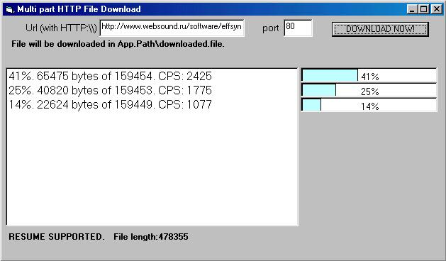



## MultiPart \(Sections\) HTTP File Downloader UserControl \(work as Flashget, Gozilla, GetSmart\)

### Description

This UserControl show to you, how split downloaded file into sections, and downloading each section simultaneously (work as Flashget, Gozilla, GetSmart).
 
### More Info
 

             |
---                |---
**Submitted On**   |2001-07-31 23:48:32
**By**             |[Lev Zabudkin](https://github.com/Planet-Source-Code/PSCIndex/blob/master/ByAuthor/lev-zabudkin.md)
**Level**          |Advanced
**User Rating**    |4.5 (373 globes from 83 users)
**Compatibility**  |VB 5\.0, VB 6\.0
**Category**       |[Internet/ HTML](https://github.com/Planet-Source-Code/PSCIndex/blob/master/ByCategory/internet-html__1-34.md)
**World**          |[Visual Basic](https://github.com/Planet-Source-Code/PSCIndex/blob/master/ByWorld/visual-basic.md)
**Archive File**   |[MultiPart 238197312001\.zip](https://github.com/Planet-Source-Code/lev-zabudkin-multipart-sections-http-file-downloader-usercontrol-work-as-flashget-gozilla-__1-25577/archive/master.zip)

